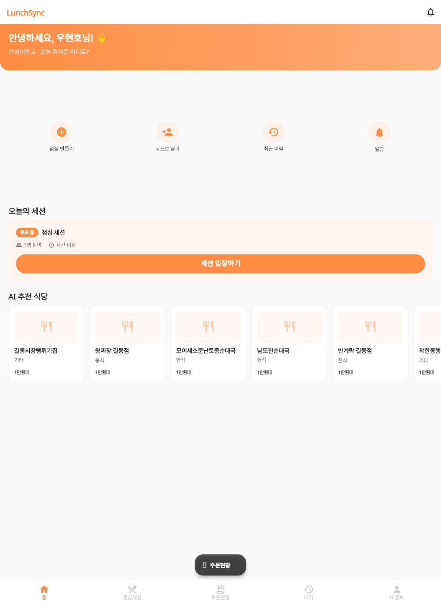
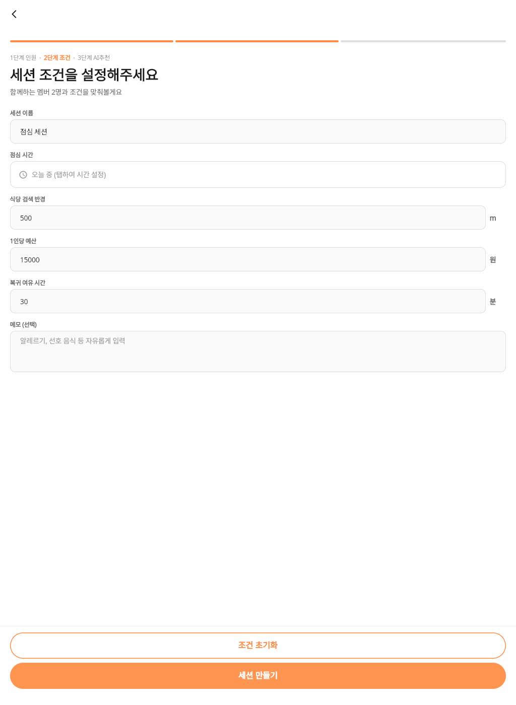
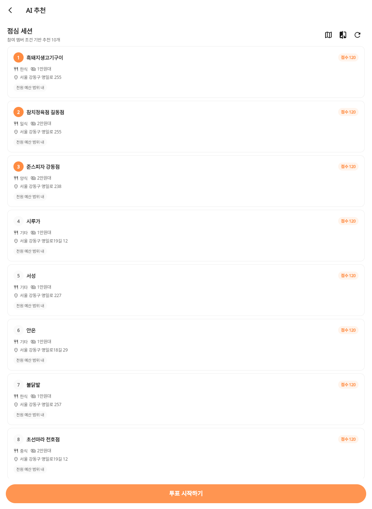
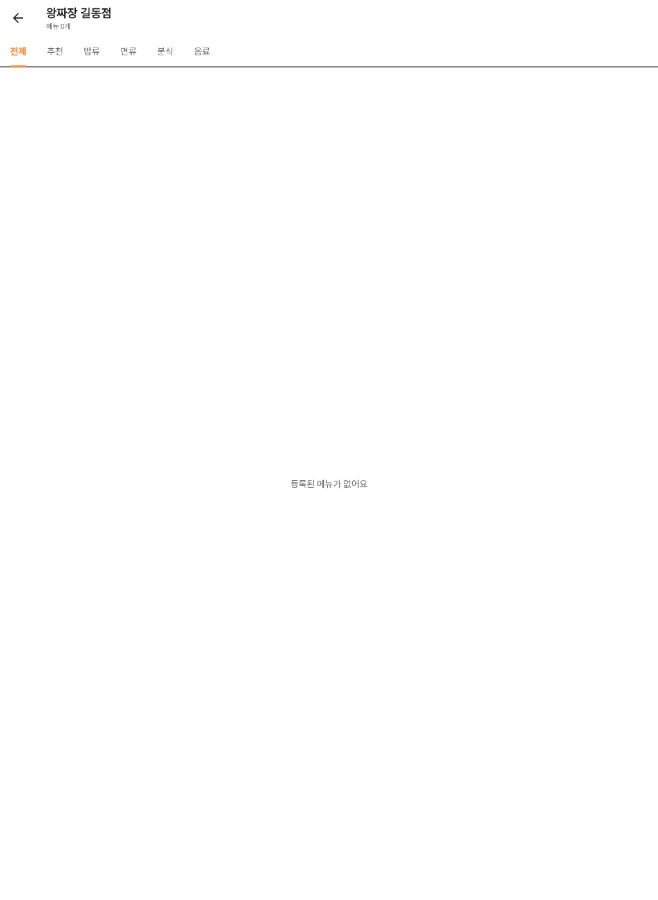
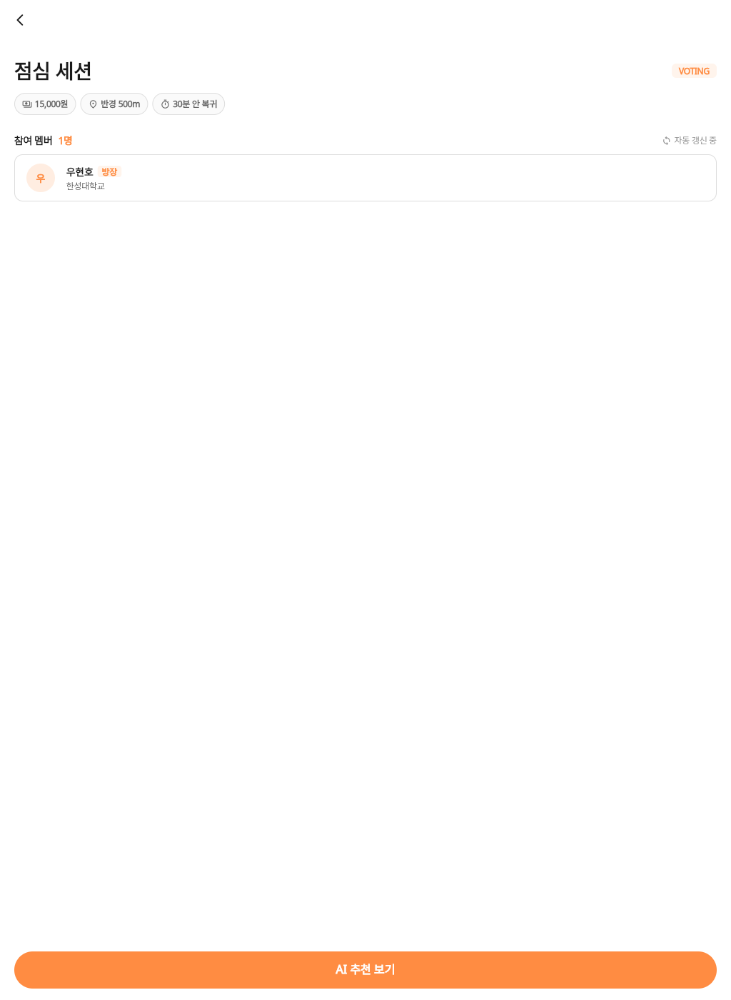
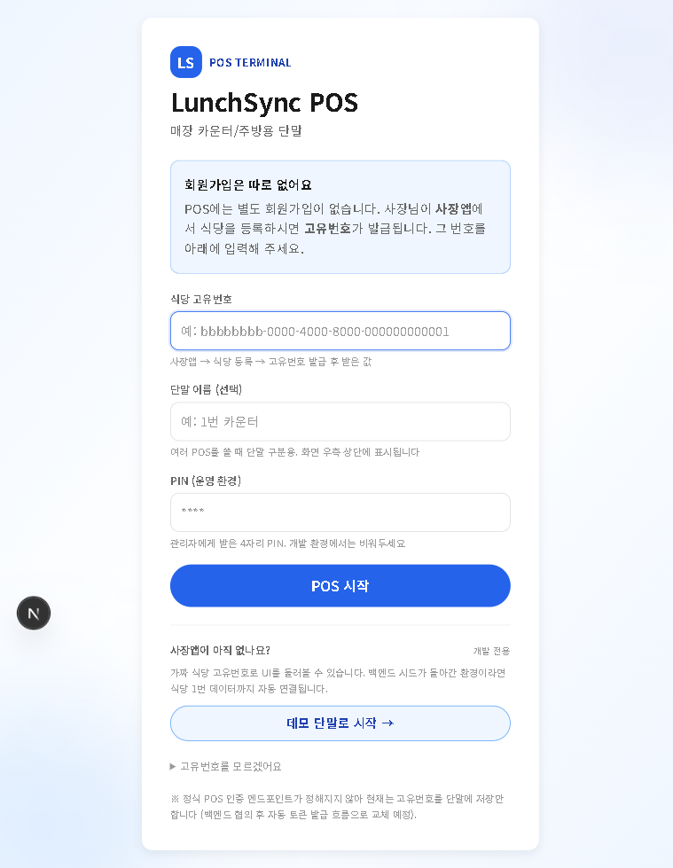
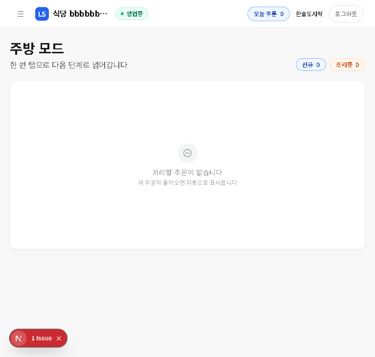
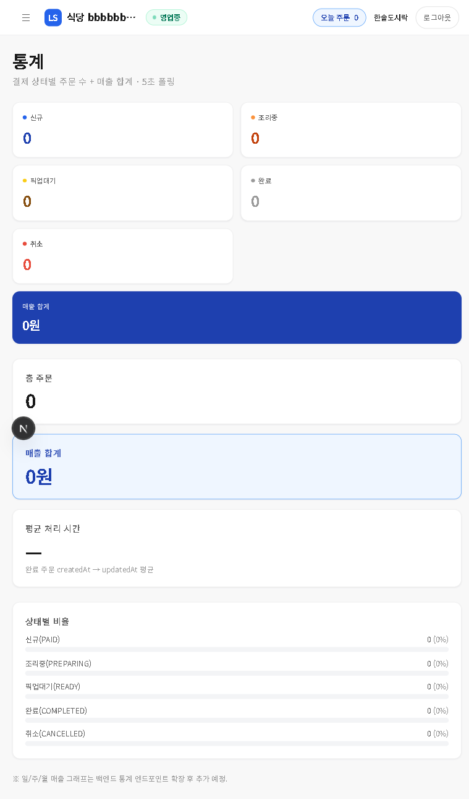

# LunchSync 사용 가이드

> AI가 추천해 주는 우리 팀 점심, 함께 정하고 한 번에 주문하세요.

---

## 1. LunchSync는?

LunchSync는 팀 단위로 점심을 함께 정하는 그룹 의사결정 앱이에요. 누가 어디서 뭘 먹을지 톡방에서 한참 고르던 시간을, AI 추천 + 멤버 투표 + 한 번에 주문/결제로 5분 안에 끝낼 수 있게 도와봐요. 식당 검색·메뉴 비교·결제·주문 추적까지 한 앱 안에서 흐름이 끊기지 않아요.



---

## 2. 누가 쓰나요?

| 역할 | 사용하는 화면 | 핵심 기능 |
|---|---|---|
| **손님 (CUSTOMER)** | LunchSync 모바일/웹 앱 | 점심 세션 만들기 · AI 추천 받기 · 투표 · 메뉴 주문 · 결제 |
| **사장 (OWNER)** | LunchSync 앱의 사장 탭 (role 분기) | 매장 정보 · 메뉴 관리 · 매출 통계 · 주문 수신 |
| **POS 단말 운영자** | LSPOS 웹 (`http://매장POS주소`) | 카운터/주방 단말에서 실시간 주문 처리 · 좌석/예약 관리 |

> 같은 LunchSync 앱 하나에서 가입 시 선택한 역할(`role`)로 화면이 자동 분기돼요. 별도 사장 앱을 설치하지 않아요.

---

## 3. 시작하기

### 시스템 요구사항

- **모바일**: Android 8 이상 / iOS 13 이상
- **웹 데모**: Chrome 최신 버전
- **개발/시연용 웹 포트**: `http://localhost:8080` (카카오 redirect URI 일치 때문에 `--web-port 8080` 고정 필수)
- **POS 단말**: 데스크톱/태블릿 Chrome 또는 Edge, 화면 가로 1024px 이상 권장

### 첫 화면 — 로그인

처음 앱을 열면 스플래시가 잠깐 뜬 뒤 로그인 화면으로 이동해요. 두 가지 방식을 골라봐요.

1. **카카오 로그인** — 손님(CUSTOMER) 가입자에게 가장 빠른 방법이에요. 본인확인까지 카카오가 처리해 주니 추가 인증이 필요 없어요.
2. **이메일 + 비밀번호 로그인** — 사장(OWNER) 가입을 원하거나 카카오를 쓰지 않을 때 선택해 봐요. 가입 시 이메일 OTP(6자리 코드) 인증을 한 번 거쳐요.

> **사장 가입(OWNER)은 승인제예요.** 가입 직후에는 `PENDING` 상태로 저장되고, 운영자가 승인하면 사장 화면에 진입할 수 있어요. 승인 전에 로그인하면 "승인 대기 중" 안내 화면이 뜨니 잠깐만 기다려 주세요.

---

## 4. 손님 — 핵심 흐름

### 4-1. 홈 — 오늘의 세션과 AI 추천

로그인하면 바로 홈으로 이동해요. 오늘 참여 중인 점심 세션, **"위치·가격·평점 기반"** 칩이 달린 AI 추천 식당 리스트, 카카오맵 미니 지도가 한 화면에 모여 있어요. 세션이 없다면 "오늘 점심 뭐 드실래요?" 빈 상태 카드가 다음 액션을 안내해 봐요. 위치 권한이 거부되어 있으면 안내 문구와 함께 **"다시 시도"** 버튼이 표시되고, 앱을 잠시 다른 화면에 두었다가 돌아오면 자동으로 추천을 다시 불러와요.


> **식당이 0개로 뜨는 일이 거의 없어요.** 카카오 검색 키가 비어 있거나 결과가 0개일 때도 Gemini AI가 좌표 기반으로 가상 식당 5개를 자동으로 만들어 채워주기 때문에, 빈 회색 화면 대신 시연·테스트 어디서나 추천 리스트가 떠요.

### 4-2. 점심 세션 만들기 (3단계)

하단 탭의 **점심세션** → **세션 만들기**를 눌러봐요.

| 단계 | 화면 | 할 일 |
|---|---|---|
| **Step 1. 멤버** | 멤버 선택 | 함께 먹을 동료를 고르거나, 일단 본인만 만들고 초대 코드를 공유해 봐요 |
| **Step 2. 조건** | 조건 설정 | 반경(500m / 1km / 1.5km), 예산(원), 속도(빠름/보통/여유) 세 가지를 정해봐요 |
| **Step 3. AI 추천** | 추천 리스트/지도 | AI가 카테고리·거리·예산을 종합해 10개 후보를 점수와 함께 보여줘요 |



> **혼자 시작해도 괜찮아요.** 멤버 선택 화면에서 친구 목록이 비어 있어도 "조건 설정으로 혼자 진행"을 누르면 바로 다음 단계로 넘어가요. 초대 코드는 만들어진 뒤에도 언제든 공유할 수 있어요.

### 4-3. 초대 코드 공유

세션이 만들어지면 **초대 코드**가 자동 생성돼요. 카카오톡·메시지·복사 버튼으로 공유해 봐요. 코드는 **24시간 동안** 유효하고, 받은 사람은 코드를 입력하면 바로 세션에 합류해요.

### 4-4. AI 추천 보기 — 카드·지도·미니게임

추천 리스트에는 10개 후보가 거리·평점·이모지(또는 실사진)와 함께 점수순으로 나와요. 화면 상단에 세 가지 진입점이 있어요.

- **🗺️ 지도 아이콘** — 위쪽 70% 카카오맵에 내 위치 핀과 식당 마커가 동시에 떠요. 아래 30%는 가로 스크롤 미니 카드라 마커를 누르면 카드가 따라 움직여요. 지도가 답답하면 우상단 **"리스트만 보기"** 칩으로 언제든 돌아올 수 있어요.
- **🎲 미니게임 아이콘** — 룰렛 또는 사다리로 후보 중 한 곳을 무작위로 뽑아봐요. 결과가 나오면 자동으로 투표 시스템에 등록되고, 방장이라면 곧바로 메뉴 화면으로 이동해요. 비교 화면에서도 같은 아이콘이 있어요.
- **사진 자동 표시** — 식당·메뉴 카드는 실제 사진이 있으면 그대로, 없으면 카테고리 이모지(한식 🍚 / 일식 🍣 / 중식 🥢 / 양식 🍝 / 분식 🍢 / 카페 ☕ / 패스트푸드 🍔 / 면류 🍜)로 채워져 빈 회색 박스가 보이지 않아요.



> **거리 칩이 정확해요.** 200m 이내는 "바로 앞", 1km 이내는 "도보 5~10분", 5km 초과는 "거리 N.N km"처럼 실제 거리에 맞춰 표기돼요. 13km 식당에 "도보 1~2분" 같은 모순 라벨이 더 이상 뜨지 않아요.

### 4-5. 투표 시작 → 투표 화면 → 자동 메뉴 라우팅

방장이 추천 리스트 하단의 **"투표 시작하기"** CTA를 누르면 세션이 `VOTING` 상태로 전환되고 멤버 전원에게 알림이 가요. 이때 **하단 CTA는 자동으로 "투표 현황 보기"로 바뀌어요** — 따로 다른 탭으로 이동하지 않아도 같은 자리에서 투표 화면에 들어갈 수 있어요.

투표 화면(`vote_progress_screen`)에는 다음이 표시돼요.

- 3초마다 자동 갱신되는 **진행도 바** (몇 명 중 몇 명이 투표했는지)
- 후보별 득표를 보여주는 **가로 바 차트**
- 아직 투표하지 않았다면 후보 카드를 탭해 바로 투표할 수 있는 UI
- 방장 전용 **"투표 종료하기"** 버튼

전원이 투표하거나 방장이 수동으로 종료하면 세션이 `ORDERED`로 바뀌고, **이긴 식당의 메뉴 화면으로 모든 멤버가 자동 이동해요.** 동점일 때는 방장이 최종 선택해요.


> **투표는 방장만 시작할 수 있어요.** 일반 멤버 화면에서는 "방장이 곧 투표를 시작해요" 안내만 보여요.

### 4-6. 식당 상세 → 메뉴 보기 → 장바구니

투표 결과로 결정된 식당의 상세 화면에서 영업 시간·⭐ 평점(네이버 실값)·거리·가격대를 확인하고, 메뉴 탭으로 이동해 봐요. 메뉴 카드를 눌러 수량을 정하고 장바구니에 담아요. 같은 세션 멤버끼리는 각자 자기 몫만 담으면 돼요.




### 4-7. 결제 — 토스 결제위젯 v2

장바구니에서 **결제하기**를 누르면 토스페이먼츠 결제위젯 v2 화면이 떠요. 카드/계좌이체/간편결제 중 골라 결제해 봐요. 결제가 완료되면 영수증 정보가 주문 내역에 자동으로 저장돼요.

### 4-8. 주문 추적

하단 탭의 **주문현황**에서 내가 결제한 주문의 상태가 실시간(3초 폴링)으로 갱신돼요.

```
PENDING → ACCEPTED → PREPARING → DONE
```

사장 POS에서 단계를 바꾸면 손님 화면에도 즉시 반영돼요. 더치페이 명세서도 같이 표시되어 누가 얼마를 냈는지 한눈에 보여요.



---

## 5. 사장 — 핵심 흐름

사장 화면은 같은 LunchSync 앱 안에 들어 있어요. OWNER 역할로 로그인하면 자동으로 사장 탭 4개가 보여요.

### 5-1. 사장 가입 → 승인 대기

이메일 + 비밀번호로 가입 시 **OWNER 라디오**를 선택하고 상호명·사업자번호·주소 등 매장 정보를 입력해 봐요. 가입 직후에는 `PENDING` 상태라서 사장 화면이 잠겨 있어요. 운영자 승인 후 다시 로그인하면 잠금이 풀려요.

### 5-2. 사장 홈 — 오늘 매출과 주문

| 탭 | 내용 |
|---|---|
| **홈** | 오늘 매출 합계, 진행 중 주문 수, 빠른 액션 카드 |
| **주문** | 들어온 주문 리스트, 결제 상태별 필터 |
| **메뉴** | 메뉴 추가/수정/삭제, 가격·카테고리·이미지 관리 |
| **내정보** | 상호명/사업자번호/연락처 수정 (실시간 캐시 반영) |

### 5-3. 메뉴 관리

새 메뉴를 등록하면 손님 앱의 메뉴 화면에 즉시 노출돼요. 손님이 "메뉴가 안 보여요"라고 하면, 사장님이 아직 등록을 안 한 상태일 가능성이 높아요.

### 5-4. 매출 통계

결제수단별(카드/계좌/간편결제) 매출을 나눠 볼 수 있어요. 일/주/월 그래프는 백엔드 통계 엔드포인트 확장 후 추가 예정이에요.

---

## 6. POS 단말 — LSPOS (Next.js)

매장 카운터/주방용 별도 웹 단말이에요. `http://매장POS주소:3001` 같은 형태로 접속해 봐요 (캡스톤 시연에서는 `localhost:3001`).

### 6-1. 단말 등록 / 로그인

처음 접속하면 로그인 화면이 떠요. 두 가지 진입 방법이 있어요.

1. **실 매장 단말** — 사장 앱에서 발급된 **식당 고유번호**를 입력하고 시작해 봐요. 사장 앱의 매장 등록 절차를 마치면 고유번호가 발급돼요.
2. **데모 단말로 시작** — 고유번호가 없어도 데모 매장으로 POS의 모든 기능을 둘러볼 수 있어요. 발표·시연 때 유용해봐요.



### 6-2. 대시보드

당일 매출, 주문 수, 좌석 상태, 결제 대기를 한 화면에 모아봐요. 영업 상태 토글(영업중/마감)도 여기 있어요.


### 6-3. 주방 모드

`PAID` / `PREPARING` 상태 주문이 큰 카드로 떠요. 한 번 탭으로 다음 상태로 전이되니 주방 직원이 장갑 낀 손으로도 누르기 좋아봐요.



### 6-4. 좌석 · 예약 · 호출 보드

- **좌석**: 5개 기본 자동 생성, 점유/공석 토글
- **예약**: 시간대별 예약 카드 관리
- **호출 보드**: 손님 호출 알림 표시


### 6-5. 통계

5초 주기로 자동 폴링되어 실시간 매출이 갱신돼요. 결제 상태별·결제수단별 분리 표시를 지원해요.



---

## 7. 자주 묻는 질문 (FAQ)

**Q. 투표가 시작되지 않아요.**
A. 투표는 **방장(세션을 만든 사람)**만 시작할 수 있어요. 멤버 1명 이상이 있어야 시작 버튼이 활성화돼요.

**Q. 식당 메뉴가 안 보여요.**
A. 사장님이 해당 매장의 메뉴를 등록해야 손님 앱에 표시돼요. 사장 앱 → 메뉴 탭에서 추가해 봐요.

**Q. 결제 후 영수증은 어디서 보나요?**
A. 손님은 **주문현황** 탭에서, 사장은 **POS의 주문 페이지**에서 결제 정보와 주문 항목을 확인할 수 있어요.

**Q. POS 고유번호를 모르겠어요.**
A. 일단 **데모 단말로 시작**을 눌러 둘러봐요. 실제 매장 운영 시에는 사장 앱에서 매장을 등록한 뒤 발급된 고유번호로 다시 로그인하면 돼요.

**Q. 사장 가입했는데 사장 화면이 안 보여요.**
A. OWNER 가입은 **운영자 승인 후** 활성화돼요. `PENDING` 상태일 때는 "승인 대기 중" 안내가 뜨니 잠깐만 기다려 주세요.

**Q. 초대 코드를 받았는데 만료됐다고 나와요.**
A. 초대 코드는 발급 후 **24시간**까지만 유효해요. 방장에게 새 코드를 요청해 봐요.

**Q. 투표 시작했는데 어디서 투표하나요?**
A. 추천 리스트 **하단의 CTA가 자동으로 "투표 현황 보기"로 바뀌어요.** 그 버튼을 누르면 진행도 바·가로 바 차트가 있는 투표 화면으로 이동해서, 후보 카드를 탭하기만 해도 투표가 등록돼요. 전원이 투표하거나 방장이 종료하면 메뉴 화면으로 자동 이동해요.

**Q. 친구 목록이 비어 있어요. 혼자서는 세션을 못 만드나요?**
A. 만들 수 있어요. 멤버 선택 화면의 빈 상태 안내에서 **"조건 설정으로 혼자 진행"** 또는 **"초대 링크로 친구 모집"** 두 가지 액션을 골라봐요. 가짜 친구 목록은 제거되어 있고, 실제 친구는 초대 코드를 공유한 사람만 합류해요.

**Q. 13km 떨어진 식당인데 "도보 1~2분"이라고 떠요.**
A. 5/14 거리 칩 정합 패치 이후로는 더 이상 모순 라벨이 표시되지 않아요. 5km를 넘는 식당은 **"거리 N.N km"** 처럼 실제 거리를 그대로 보여줘요. 200m / 500m / 1km / 1.5km / 5km 분기로 도보·차량 표기가 자동 분류돼요.

---

## 8. 알려진 제한 / 추후 개선

- **iOS Phone Auth**: GoogleService-Info.plist 미반영으로 iOS 휴대폰 인증은 추후 적용 예정 (Android·웹은 정상 동작)
- **권한별 인증·결제**: 캡스톤 시연은 데모 환경 기준이며, 실 운영 시 모바일/실 기기 검증을 권장해봐요
- **일/주/월 매출 그래프**: 백엔드 통계 엔드포인트 확장 후 사장 앱·POS에 추가될 예정
- **OAuth**: 카카오 외 OAuth(Google, Apple 등)는 현재 미지원
- **WebSocket 실시간**: 현재 3초 폴링 기반, 향후 WebSocket으로 교체 가능한 구조로 설계돼 있어요

> 2026-05-15 업데이트: POS 환불 흐름은 자동 환불(토스 cancel API) 로 구현 완료. 사장님 거절 시 손님 결제 자동 환불 + status CANCELLED 원자성 보장.

---

## 9. 2026-05-15 발전 로드맵 (배민/쿠팡이츠/캐치테이블 패턴 통합)

자율 진행 로드맵 9 commit — 임시 브랜치 `experiment/roadmap-20260515`. 사장님 라이브 검증 후 `feat/hyunho` 로 merge 결정.

### 새 기능 5종

| 기능 | 시중 앱 패턴 | 사장님 검증 시나리오 |
|---|---|---|
| **자동 환불** | 배민/쿠팡이츠 | 사장 어플에서 주문 "취소 + 환불" → 토스 결제 내역 환불 표시 + orders.status CANCELLED |
| **주문 상태 5단계 + 푸시** | 배민 stepper | PAID → ACCEPTED → PREPARING → READY → COMPLETED 전이마다 손님 푸시 |
| **즐겨찾기** | 배민 핵심 | 식당 상세 하트 토글 → 홈 화면 가로 스크롤 위젯 + 내정보 탭 카운트 |
| **별점/리뷰** | 배민 | 손님 COMPLETED 후 별 5개 + 리뷰 → 사장 어플 매장 평점 카드 + 리뷰 리스트 |
| **시드 데이터** | — | 식당 28개 + 메뉴 140개 + 주문 30건 + 리뷰 12건 (UUID 분리, 실데이터 영향 0) |

### 사장님 복귀 시 Dashboard SQL 실행 순서

```
1. 2026-05-15-add-order-status-enum.sql   (이미 실행)
2. 2026-05-15-add-user-favorites.sql      (즐겨찾기)
3. 2026-05-15-add-order-review.sql        (별점/리뷰)
```

**시드 데이터 (선택 — 풍부한 데모용)**:
```
1. 2026-05-15-seed-diverse-restaurants.sql
2. 2026-05-15-seed-diverse-users.sql
3. 2026-05-15-seed-demo-friends.sql
4. 2026-05-15-seed-demo-orders-reviews.sql
5. 2026-05-15-verify-diverse-seed.sql
```

모두 멱등 (`ON CONFLICT DO NOTHING`, `IF NOT EXISTS`) → 재실행 안전.

### 사장님 복귀 시 백엔드 재시작 1회 필요

ae6aa69 E2E 에이전트가 fix 한 회귀 3건 (health throttle, POS ACCEPTED ENUM, orders.service 빌드) 효과 발휘에 백엔드 1회 재시작 필요.

```
cd backend && npm run start:dev
```

---

## 부록 — 빠른 시작 체크리스트

손님으로 처음 써 본다면:

- [ ] LunchSync 앱 열기 (또는 `http://localhost:8080` 접속)
- [ ] 카카오 로그인
- [ ] 프로필·기본 조건(반경/예산/속도) 설정
- [ ] 홈에서 **세션 만들기** 탭
- [ ] 3단계 마법사 따라가기 (멤버 → 조건 → AI 추천)
- [ ] 초대 코드 동료에게 공유
- [ ] 투표 시작 → 결정 → 메뉴 담기 → 결제
- [ ] 주문현황 탭에서 상태 추적

사장으로 처음 써 본다면:

- [ ] 이메일 가입 시 **OWNER 선택** + 매장 정보 입력
- [ ] 이메일 OTP 인증
- [ ] 운영자 승인 대기
- [ ] 승인 후 로그인 → 사장 탭에서 메뉴 등록
- [ ] POS 단말 접속 → 발급된 고유번호로 로그인
- [ ] 대시보드/주방/좌석/통계 둘러보기

---

LunchSync 팀 · 캡스톤 2026
