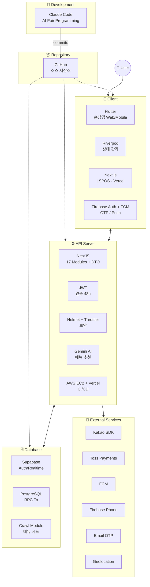

# LunchSync 시스템 구조도 — AI 이미지 생성 프롬프트

이 문서는 LunchSync 프로젝트의 시스템 구조도를 AI 이미지 생성 도구(ChatGPT 이미지/DALL·E/Midjourney/Stable Diffusion 등)로 만들기 위한 프롬프트 모음입니다. 용도에 맞는 섹션을 골라서 복사·붙여넣기 하세요.

---

## 1. 한국어 프롬프트 (ChatGPT 이미지 생성용)

> 아래 텍스트를 그대로 복사해서 ChatGPT(GPT-4o 이미지 생성) 또는 Gemini에게 전달하세요.

```
LunchSync(런치싱크) 프로젝트의 시스템 구조도를 깔끔한 다이어그램 스타일로 그려줘.
모던하고 미니멀한 파스텔톤 디자인, 둥근 모서리 카드 박스, 각 박스 안에 기술 로고/뱃지와 설명을 배치해.
배경은 흰색, 배치는 다음과 같아.

**최상단 좌측 (Development 영역, 살구색/오렌지 톤):**
- Claude Code (Anthropic): AI 페어 프로그래밍 도구 — 코드 작성/리뷰/리팩토링을 담당, GitHub로 commits 전달

**최상단 우측 (Repository 영역, 보라색 톤):**
- GitHub: 소스 코드 저장소

> Development → Repository 로 "commits" 화살표 연결

**중앙 가로 3개 영역:**

좌측 (Client 영역, 민트 그린 톤):
- Flutter: 손님 앱 (Web/Mobile) — Riverpod 상태 관리
- Next.js: LSPOS (사장님용 POS 웹앱, Vercel 배포)
- Firebase Auth + FCM: 휴대폰 OTP / 푸시 알림

중앙 (API Server 영역, 연한 분홍 톤):
- NestJS: 17개 모듈 (auth/users/sessions/votes/orders/payments/recommendations/restaurants/pos/invitations/notifications/crawl/gemini 등) + DTO 검증
- JWT: 인증 / 권한 검증 (48시간 만료)
- Helmet + Throttler: 보안 헤더 / Rate Limit
- Gemini AI: 메뉴 자동 생성 / 추천
- AWS EC2 + Vercel: CI/CD via GitHub Actions

우측 (Database 영역, 연한 파랑 톤):
- Supabase: Auth / Realtime / Storage
- PostgreSQL: 데이터 저장 / RPC 트랜잭션
- Crawl Module: 메뉴 시드 데이터 수집

**최하단 (External Services 영역, 연한 회색 톤, 6개 박스 2x3 그리드):**
- Kakao SDK (노란색 K 뱃지): 카카오 로그인
- Toss Payments (파란색 T 뱃지): 결제 모듈
- FCM (주황색 뱃지): 푸시 알림
- Firebase Phone (노란색 FA 뱃지): SMS 본인 확인
- Email OTP (보라색 @ 뱃지): 이메일 인증 (Supabase Auth 프록시)
- Geolocation (초록색 GP 뱃지): GPS / 지도 기반 추천

**연결 화살표:**
- 사용자(User 아이콘) → Client
- Repository → Client / API Server / Database (각각 점선 또는 실선)
- Client ↔ API Server (양방향, REST API)
- API Server ↔ Database
- API Server → External Services

**제목:** 하단 중앙에 "LunchSync 시스템 구조도" (큰 글씨), 그 아래 작은 글씨로 "Flutter + NestJS + Supabase + Gemini AI 기반 단체 점심 메뉴 결정 플랫폼"

전체 비율: 가로 16:9, 다이어그램 스타일 (Excalidraw/draw.io 느낌), 일러스트가 아닌 인포그래픽 형태.
```

---

## 2. 영어 프롬프트 (DALL·E / Midjourney용)

> 영어 기반 AI 도구에 사용할 버전. Midjourney에는 `--ar 16:9 --style raw` 같은 파라미터를 뒤에 붙이세요.

```
A clean, modern system architecture diagram for "LunchSync" application,
infographic style with rounded rectangle cards, pastel color palette, white background.

Layout (top to bottom):

TOP-LEFT — Development (peach/orange card):
- Claude Code (Anthropic): AI pair programming assistant — handles code writing, review, refactoring; pushes commits to GitHub

TOP-RIGHT — Repository (purple/lavender card):
- GitHub (source code repository)

> Arrow from Development -> Repository labeled "commits"

MIDDLE ROW (three cards side by side):

LEFT — Client (mint green card):
- Flutter: Customer app (Web/Mobile) with Riverpod state management
- Next.js: LSPOS owner POS web app (deployed on Vercel)
- Firebase Auth + FCM: Phone OTP / Push notifications

CENTER — API Server (light pink card):
- NestJS: 17 modules (auth/users/sessions/votes/orders/payments/recommendations/restaurants/pos/invitations/notifications/crawl/gemini) with DTO validation
- JWT: Authentication / authorization (48h expiry)
- Helmet + Throttler: Security headers / Rate limiting
- Gemini AI: Menu auto-generation / recommendation
- AWS EC2 + Vercel: CI/CD via GitHub Actions

RIGHT — Database (light blue card):
- Supabase: Auth / Realtime / Storage
- PostgreSQL: Data storage / RPC transactions
- Crawl Module: Menu seed data collection

BOTTOM — External Services (light gray card, 2x3 grid of circular icon badges):
- Kakao SDK (yellow K badge): Kakao Login
- Toss Payments (blue T badge): Payment module
- FCM (orange badge): Push notifications
- Firebase Phone (yellow FA badge): SMS verification
- Email OTP (purple @ badge): Email verification via Supabase Auth
- Geolocation (green GP badge): GPS / map-based recommendation

CONNECTIONS (arrows):
- User icon (far left) -> Client
- Repository -> Client / API Server / Database
- Client <-> API Server (bidirectional, REST API)
- API Server <-> Database
- API Server -> External Services

TITLE at bottom center: "LunchSync System Architecture" (large bold text)
Subtitle: "Group Lunch Decision Platform powered by Flutter + NestJS + Supabase + Gemini AI"

Style: Clean infographic, Excalidraw / draw.io aesthetic, NOT illustration.
Aspect ratio: 16:9. Soft shadows, anti-aliased text, professional presentation quality.
```

---

## 3. Mermaid 다이어그램 (텍스트 기반, GitHub/Notion 호환)

> AI가 아닌 실제 다이어그램 도구가 필요할 때. `mermaid.live`에 붙여넣거나 마크다운 렌더러가 mermaid를 지원하면 자동 렌더링됩니다.



---

## 4. 우리 코드 스택 요약 (다른 프롬프트 만들 때 참고)

| 영역 | 기술 스택 | 파일/위치 |
|---|---|---|
| Development | Claude Code (Anthropic) — AI 페어 프로그래밍 | 커밋 메시지 `Co-Authored-By: Claude` 표기 |
| Client (앱) | Flutter 3, Riverpod | `lib/`, `pubspec.yaml` |
| Client (POS) | Next.js (Vercel) | `origin/LSPOS` 브랜치 |
| API Server | NestJS 11 | `backend/src/` (17 모듈) |
| 인증 | JWT (48h), Helmet, Throttler, class-validator | `backend/src/auth/` |
| AI | Google Gemini API | `backend/src/gemini/` |
| Database | Supabase + PostgreSQL | `@supabase/supabase-js` |
| Crawl | 메뉴 시드 데이터 수집 | `backend/src/crawl/` |
| Auth (사용자) | Kakao SDK, Firebase Phone, Email OTP | `lib/services/{kakao,fcm,email_otp}_*.dart` |
| 결제 | Toss Payments (WebView 연동) | `lib/services/payments_api_service.dart` |
| 푸시 | FCM (Firebase Cloud Messaging) | `lib/services/fcm_service.dart` |
| 위치 | Geolocator + 외부 지도 앱 연동 | `lib/services/geolocation_service.dart` |
| 배포 | AWS EC2 (PM2), Vercel, GitHub Actions | `.github/workflows/` |

---

## 5. 사용 팁


- **ChatGPT (GPT-4o 이미지)**: 섹션 1의 한국어 프롬프트 그대로 사용. 한 번에 안 나오면 "더 깔끔하게", "박스 모서리를 더 둥글게" 같은 추가 지시 가능.
- **DALL·E 3 (직접 API)**: 섹션 2 영어 프롬프트 사용. 글자가 깨질 수 있으니 "render text clearly" 추가 권장.
- **Midjourney**: 섹션 2 영어 프롬프트 끝에 `--ar 16:9 --style raw --v 6` 추가. 단, MJ는 텍스트 렌더링이 약해서 추천하지 않음.
- **Mermaid**: 섹션 3을 마크다운에 그대로 붙여넣기. GitHub README, Notion, Obsidian 등에서 자동 렌더링.
- **수정 가이드**: 새 기술 스택이 추가되면 섹션 4 표를 먼저 업데이트하고, 그 변경을 섹션 1~3에 반영.
